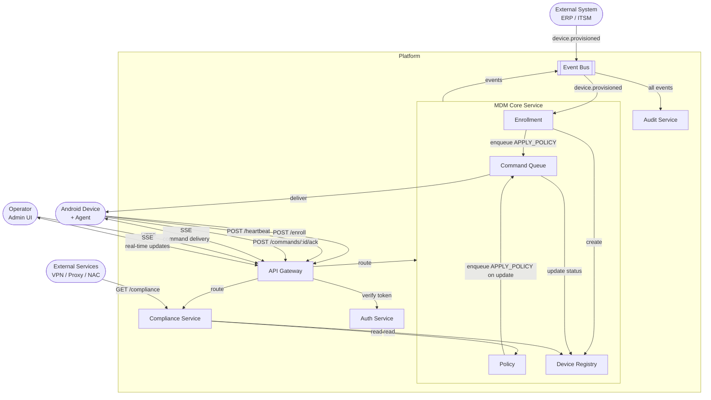

# MDM Platform (monorepo)

Корпоративная платформа управления устройствами (Mobile Device Management).  
Цель: устройство проходит enrollment, система контролирует его состояние и сообщает внешним системам, имеет ли оно доступ к внутренним ресурсам.

---

<details>
<summary><strong>Сервисы и взаимодействие</strong></summary>



### Описание сервисов

| Сервис | Ответственность |
|---|---|
| **API Gateway** | Единая точка входа. Роутинг, auth middleware, SSE транспорт |
| **Auth Service** | JWT для операторов, service token для внешних систем, device certificate при enrollment |
| **MDM Core** | Device Registry, Enrollment, Command Queue, Policy — всё про жизнь устройства |
| **Compliance Service** | Read-only фасад для внешних систем. Вычисляет доверие на основе данных Core |
| **Audit Service** | Подписывается на все события через Event Bus. Append-only хранилище |
| **Event Bus** | Декаплинг внешних интеграций и внутренних событий |
| **Admin UI** | Real-time dashboard. Local-first: читает из локального стора, синхронизируется через SSE |

</details>

---

<details>
<summary><strong>Транспортный слой</strong></summary>

## Решения

### Gateway — Kubernetes Ingress

Единая точка входа — nginx Ingress в Kubernetes. Отдельного Gateway-сервиса нет.

Аннотации для долгоживущих SSE-соединений:
```yaml
nginx.ingress.kubernetes.io/proxy-read-timeout: "3600"
nginx.ingress.kubernetes.io/proxy-buffering: "off"
```

---

### Изоляция клиентов — URL-префиксы

Один порт, разные префиксы. Изоляция через middleware (разные стратегии аутентификации).

| Префикс | Клиент | Auth |
|---|---|---|
| `/admin/*` | Оператор | JWT (Bearer token) |
| `/device/*` | Android Agent | Device certificate / enrollment token |
| `/external/*` | Внешние системы | Service token |

---

### Push-транспорт — SSE

SSE (Server-Sent Events) — единственный push-транспорт для всех клиентов.  
WebSocket не используется: команды однонаправлены (сервер → устройство), ACK отправляется отдельным REST-запросом.

---

### Offline-доставка команд

Команды персистируются в Command Queue немедленно. Доставка — при подключении устройства через SSE-стрим. Если устройство долго offline — push-уведомление (FCM/APNs, за скоупом MVP).

```
QUEUED → [устройство подключилось] → DELIVERED → [ack получен] → ACKED
                                          ↓
                                        FAILED → RETRYING → EXPIRED
```

---

### SSE state — in-memory → Redis

MVP использует in-memory хранилище активных SSE-соединений.  
Production-цель — Redis pub/sub. Изоляция через порт `EventPublisher`:

```
EventPublisher (port)
  ├── InMemoryEventPublisher   ← MVP
  └── RedisEventPublisher      ← production
```

---

## Эндпоинты

| Клиент | Транспорт | Метод | Путь | Назначение |
|---|---|---|---|---|
| Оператор | REST | `GET` | `/admin/devices` | Список устройств |
| Оператор | REST | `POST` | `/admin/devices/{id}/commands` | Отправить команду |
| Оператор | SSE | `GET` | `/admin/events` | Реал-тайм обновления UI |
| Устройство | REST | `POST` | `/device/enroll` | Enrollment |
| Устройство | REST | `POST` | `/device/heartbeat` | Heartbeat, sync check |
| Устройство | REST | `POST` | `/device/commands/{id}/ack` | Подтверждение команды |
| Устройство | SSE | `GET` | `/device/commands/stream` | Получение команд |
| Внешние системы | REST | `GET` | `/external/devices/{id}/compliance` | Compliance check |
| ERP/ITSM | NATS | — | `devices.provisioned` | Pre-staging устройства |

</details>

---

<details>
<summary><strong>Доменная модель</strong></summary>

## Компоненты

### Device

Центральная сущность системы. Хранит факты о себе: идентификатор, серийный номер, модель, локация, версия применённой политики, время последнего контакта. Не принимает решений — только хранит факты.

**State machine:**
```
UNKNOWN → PENDING_ENROLLMENT → ENROLLING → ENROLLED
                                                ↓
                                         NON_COMPLIANT
                                                ↓
                                           OFFLINE
                                                ↓
                                         WIPED / RETIRED
```

---

### Enrollment

Одноразовый процесс принятия устройства в систему. Проверяет, что устройство **ожидается** (pre-staged) и токен валиден, создаёт идентификатор устройства и выдаёт credentials. По завершении автоматически инициирует первую команду `APPLY_POLICY`.

---

### Policy

Хранит **что именно** должно быть применено на устройстве. Версионируется — устройство всегда знает, актуальную ли версию оно применило. Не знает, как устройство применяет правила — это дело агента.

---

### Command

Единый механизм доставки намерений на устройство — и от оператора, и от системы. Хранит команду до получения ack, обеспечивает доставку даже если устройство было offline.

Политика взаимодействует с устройством через тот же механизм — путём порождения команды `APPLY_POLICY`.

**Типы команд:**

| Тип | Инициатор | Описание |
|---|---|---|
| `APPLY_POLICY` | система | Применить набор правил (payload: policy rules) |
| `LOCK` | оператор | Заблокировать экран |
| `UNLOCK` | оператор | Разблокировать |
| `NOTIFY` | оператор | Показать уведомление на устройстве |
| `WIPE` | оператор | Сброс до заводских настроек |
| `SYNC` | система / оператор | Принудительная синхронизация политик |

**Жизненный цикл команды:**
```
QUEUED → DELIVERED → ACKED
             ↓
           FAILED → RETRYING → EXPIRED
```

---

### Compliance

Отвечает на один вопрос: **можно ли доверять этому устройству сейчас?**  
Агрегирует факты из Device и Policy: enrolled? политика актуальна? last_seen свежий?  
Выдаёт единый ответ наружу — без деталей внутренней кухни.  
Не хранит своё состояние — вычисляет на основе данных других доменов.

---

### Audit Log

Фиксирует **что произошло** — иммутабельно и полно.  
Записывает каждое значимое событие во всех доменах: enrollment, смена политики, выполнение команд, смена статуса.  
Не изменяется, не удаляется. Только чтение.

| Поле | Описание |
|---|---|
| `timestamp` | Время события (UTC) |
| `device_id` | Идентификатор устройства |
| `actor` | Кто инициировал: `system`, `admin@corp.com` |
| `action` | `enrollment`, `policy_applied`, `lock`, `wipe`, ... |
| `status` | `success` / `failed` |
| `payload` | JSON-детали события |

</details>

---

<details>
<summary><strong>Сценарии</strong></summary>

## MVP-сценарии

### Сценарий 1 — Device Pre-staging (внешнее событие)

Закупки приобретают новое устройство и регистрируют его во внешней системе (ERP, ITSM и т.п.).  
Наша система получает событие через **Message Bus** (NATS topic `devices.provisioned`).  
Формат интеграции — за скоупом этой системы; на входе ожидается:

```json
{
  "event": "device.provisioned",
  "serial": "SN-XXXXXXXX",
  "model": "Samsung Galaxy XCover 6",
  "assigned_location": "warehouse-msk-01"
}
```

После получения события система создаёт запись устройства со статусом `PENDING_ENROLLMENT`  
и генерирует одноразовый **enrollment token**, привязанный к серийному номеру.

> ⚙️ Интеграция описана в [`docs/integration-provisioning.md`](docs/integration-provisioning.md) *(coming soon)*

---

### Сценарий 2 — Enrollment

Устройство на точке использования инициирует enrollment (агент установлен в factory/MDM-режиме).

```
Устройство  →  POST /device/enroll  { serial, enrollment_token, device_info }
                       ↓
             Проверка: serial существует и статус PENDING_ENROLLMENT
             Проверка: enrollment_token валиден и не истёк
                       ↓
             Создаётся device_id (UUID)
             Выдаётся device certificate (для последующих запросов)
             Статус → ENROLLING
                       ↓
Устройство  ←  { device_id, certificate, sse_endpoint, policy_version: 0 }
```

После успешного ответа система автоматически ставит в очередь команду `APPLY_POLICY`.

---

### Сценарий 3 — Policy Push и подтверждение

```
Command Queue  →  APPLY_POLICY { policy_id, payload: { ... } }
                       ↓
Устройство получает команду через SSE-стрим (или при следующем heartbeat если offline)
                       ↓
Агент применяет политику (пароль, шифрование, запрет приложений и т.п.)
                       ↓
Устройство  →  POST /device/commands/{command_id}/ack  { status: "success" | "failed", error? }
                       ↓
             Статус устройства → ENROLLED (compliant) или NON_COMPLIANT
             Запись в Audit Log
```

**Команды персистентны** — если устройство offline, команда остаётся в очереди до получения ack или истечения TTL.

---

### Сценарий 4 — Compliance Check (интеграция с внешними системами)

Внешние системы (VPN-шлюз, reverse proxy, NAC) могут проверить статус устройства:

```
GET /external/devices/{device_id}/compliance
Authorization: Bearer <service-token>

← 200 OK
{
  "device_id": "...",
  "enrolled": true,
  "compliant": true,
  "last_seen": "2026-04-12T20:00:00Z",
  "policy_version": 3
}
```

На основе этого ответа внешняя система принимает решение о допуске к внутренним ресурсам.  
Эндпоинт read-only, не требует агента, доступен внутри периметра.

> 🔐 Подробнее: [`docs/compliance-api.md`](docs/compliance-api.md) *(coming soon)*

---

### Сценарий 5 — Remote Commands

Оператор через Admin UI (или API) отправляет команду на устройство — см. таблицу в доменной модели.

```
POST /admin/devices/{device_id}/commands
{ "type": "LOCK", "initiated_by": "admin@corp.com" }

← 202 Accepted  { "command_id": "...", "status": "queued" }
```

Команда доставляется через SSE-стрим (если устройство online) или при следующем heartbeat.

---

### Сценарий 6 — Heartbeat и обнаружение offline

```
Агент  →  POST /device/heartbeat  { device_id, battery, os_version, policy_version }
                ↓
          Обновляется last_seen, статус ONLINE
          Если policy_version устарела → возвращается { action: "sync_policy" }
                ↓
          Если нет heartbeat > 5 минут → статус OFFLINE
          SSE event → UI обновляется без перезагрузки
```

---

## Что вне скоупа MVP

- Интеграция с реальным Android MDM Agent (используется симулятор агента)
- Apple iOS / Windows устройства
- Логика внешней системы provisioning (ERP/ITSM) — только входящий event
- BYOD / личные устройства сотрудников
- Геолокация и геофенсинг
- Push-уведомления (FCM/APNs) для offline-устройств

</details>
