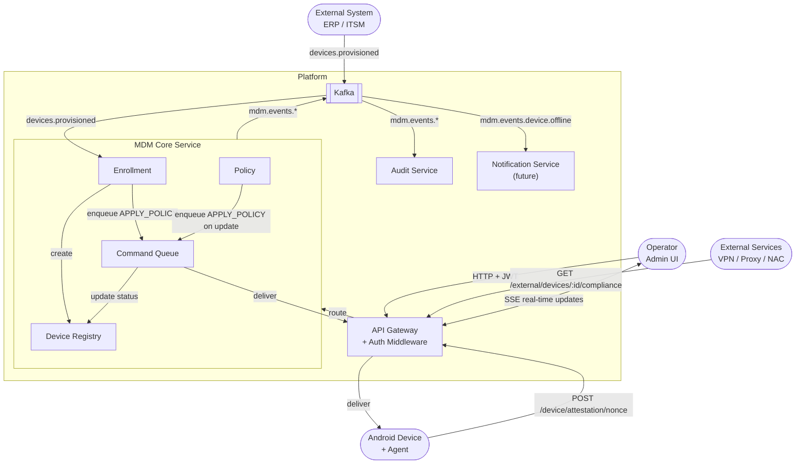

# MDM Platform — Architecture

Платформа управляет корпоративными Android-устройствами: принимает их в систему, контролирует состояние и отвечает внешним системам на вопрос — можно ли этому устройству доверять. Устройства принадлежат компании и работают в изолированной корпоративной сети.

---

## Система

Платформа состоит из нескольких сервисов с чёткими границами ответственности, асинхронной шины событий и единой точки входа.

Три типа клиентов взаимодействуют с системой по-разному: устройства проходят enrollment и получают команды, операторы управляют устройствами и наблюдают за состоянием в реальном времени, внешние системы задают один вопрос — compliant или нет.

---

## Компоненты

**API Gateway** — единственная точка входа. Не содержит бизнес-логики: только маршрутизация, аутентификация и SSE-транспорт. Три префикса — три стратегии аутентификации: `/admin/*` проверяет JWT, `/device/*` проверяет device certificate или enrollment token, `/external/*` проверяет service token. Клиенты изолированы друг от друга на уровне middleware — устройство не может обратиться к admin-эндпоинту и наоборот.

**MDM Core** — сердце системы. Знает какие устройства должны быть в системе, принимает новые, отслеживает их состояние и доставляет на них управляющие воздействия. Отвечает внешним системам на вопрос о доверии через `/external/devices/:id/compliance` — это read-only application service внутри Core, который вычисляет compliance из тех же доменных данных. Это единый сервис, а не несколько — потому что это один домен: устройство, политика, команда и процесс принятия в систему не существуют друг без друга.

**Audit Service** — подписчик на все события. Пишет только, никогда не читает обратно в Core. Append-only. Независим от Core — Core не знает о его существовании.

---

## Ключевые решения

### Enrollment — двухшаговый, с аппаратной аттестацией

Enrollment без аттестации означает что любой, знающий serial и enrollment token, может зарегистрировать произвольное устройство. Токен можно перехватить, serial — считать с корпуса.

Мы используем аппаратную аттестацию через Android Keystore. Производитель прошивает ключи в защищённый элемент при производстве. Устройство подписывает одноразовый nonce этим ключом и передаёт цепочку сертификатов. Мы верифицируем цепочку локально — без обращения к внешним сервисам. Это работает в изолированной сети.

Nonce одноразовый, привязан к serial, инвалидируется сразу после использования. Replay-атака невозможна.

### Command Queue — внутри Core, в той же базе

Command — это доменный объект, не инфраструктурная очередь. У команды есть жизненный цикл: `QUEUED → DELIVERED → ACKED → FAILED → RETRYING → EXPIRED`. Это состояние принадлежит Core.

Если вынести очередь в отдельный сервис — Core становится зависимым от него для чтения своего же доменного состояния. Либо Queue-сервис хранит состояние, и тогда Core должен спрашивать у него — это инверсия владения. Либо Core хранит состояние, и тогда Queue-сервис это просто транспорт которого незачем выделять.

Command Queue живёт там, где живут остальные объекты домена.

### SSE вместо WebSocket для доставки команд

Команды идут в одну сторону: сервер → устройство. Устройство не инициирует диалог — оно только подтверждает выполнение отдельным REST-запросом через ту же pipeline аутентификации.

WebSocket — двусторонний канал — избыточен для этой задачи. SSE проще, работает поверх обычного HTTP/1.1, не требует специальной обработки на прокси и балансировщиках. Одна аннотация на nginx Ingress — и долгоживущие соединения работают.

При каждом подключении устройство сначала получает все `QUEUED` команды из базы, затем переходит в live-режим. `Last-Event-ID` — подсказка для переподключения, но не источник истины. Command Queue всегда авторитетна.

### Kafka для межсервисного взаимодействия

Audit Service должен фиксировать все события. Если доставлять события синхронно — Core зависит от Audit, и временная недоступность Audit блокирует Core. Это неприемлемо.

Kafka инвертирует зависимость: Core публикует события и не знает кто их слушает. Audit подписывается и гарантированно получает всё — даже если он был временно недоступен, он прочитает пропущенное при восстановлении. Core и Audit независимы. Добавление нового подписчика — Notification Service, новая аналитика — не требует изменений в Core.

---

## Компромисы

**SSE state — in-memory.** Активные SSE-соединения хранятся в памяти процесса. При нескольких репликах Core событие нужно доставить в нужную реплику. Сейчас это не проблема — MVP работает с одной репликой. Порт `EventPublisher` заложен, `InMemoryEventPublisher` меняется на `RedisEventPublisher` без изменений в домене.

**Один инстанс Core.** Горизонтальное масштабирование Core упирается в SSE state. До Redis это архитектурное ограничение, а не баг.

**Service token для внешних систем — статический.** Ротация и отзыв не реализованы. Приемлемо для MVP в закрытой сети, критично в production.

**Kafka ACL отсутствуют.** Любой сервис технически может читать любой топик. Для изолированного кластера это допустимо на старте, но должно быть исправлено до выхода в production.

**mTLS между сервисами не реализован.** Внутренний трафик не шифруется и не аутентифицируется на транспортном уровне. Периметр защищён, но компрометация одного сервиса даёт доступ к внутренней сети.

---

## Точки роста

Система спроектирована так, чтобы эти изменения не затрагивали доменную логику.

`EventPublisher` — порт. `InMemoryEventPublisher → RedisEventPublisher` даёт горизонтальное масштабирование Core и корректную доставку SSE в multi-replica окружении.

`EmailSender` — порт. `StubEmailSender → SMTPEmailSender / SESEmailSender` без изменений в домене.

Notification Service — подписчик на Kafka, который уже публикует нужные события. Добавляется без изменений в Core.

iOS и Windows устройства — новые адаптеры аттестации. Домен Enrollment не меняется — меняется верификация цепочки сертификатов под конкретного производителя.

Если внешних систем станет много или compliance-запросы начнут влиять на нагрузку Core, комплайенс может быть вынесен в отдельный read-model сервис с собственным стором, обновляемым по событиям из Kafka. Сейчас это application service внутри Core.
