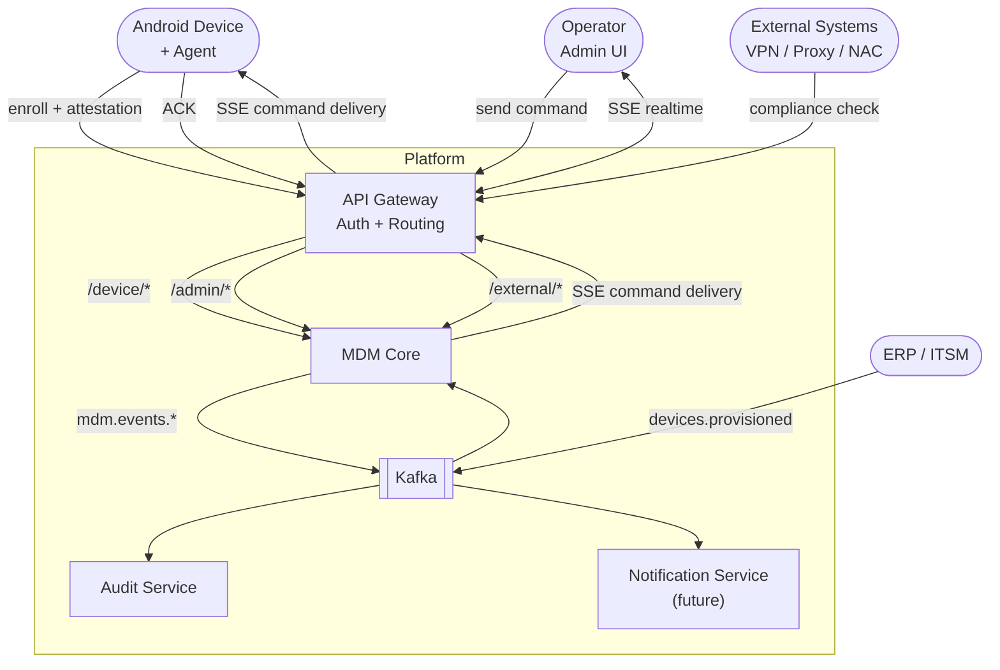
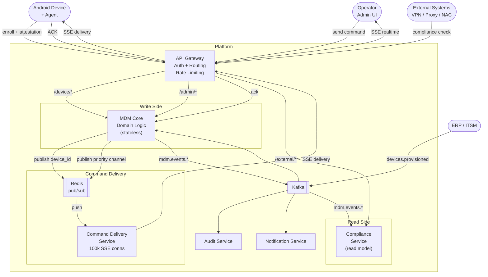

# MDM Platform — Architecture

Платформа управляет корпоративными Android-устройствами: принимает их в систему, контролирует состояние и отвечает внешним системам на вопрос — можно ли этому устройству доверять. Устройства принадлежат компании и работают в изолированной корпоративной сети.

---

## Система

Все клиенты взаимодействуют с платформой **только через API Gateway**. Gateway аутентифицирует запрос и передаёт его в Core — никакого прямого доступа к сервисам нет.

Три контура клиентов, три стратегии аутентификации:
- `/device/*` — устройства (device certificate или enrollment token)
- `/admin/*` — операторы (JWT)
- `/external/*` — внешние доверяющие системы (service token)

Два ключевых процесса проходят через Gateway: **Enrollment** — принятие устройства в систему, **Command Delivery** — доставка команд на устройство по SSE. Остальные интеграции асинхронны через Kafka.



---

## Компоненты

**API Gateway** — единственная точка входа. Не содержит бизнес-логики: только маршрутизация, аутентификация и SSE-транспорт. Клиенты изолированы друг от друга на уровне middleware — устройство не может обратиться к admin-эндпоинту и наоборот.

**MDM Core** — сердце системы. Знает какие устройства должны быть в системе, принимает новые, отслеживает их состояние и доставляет на них управляющие воздействия. Отвечает внешним системам на вопрос о доверии — это read-only application service внутри Core, который вычисляет compliance из тех же доменных данных. Это единый сервис, а не несколько — потому что это один домен: устройство, политика, команда и процесс принятия в систему не существуют друг без друга.

**Audit Service** — подписчик на все события. Пишет только, никогда не читает обратно в Core. Append-only. Независим от Core — Core не знает о его существовании.

---

## Ключевые решения

Это решения, у которых есть неочевидная альтернатива. Выбор не очевиден — поэтому зафиксирован.

### Enrollment — двухшаговый, с аппаратной аттестацией

Enrollment без аттестации означает что любой, знающий serial и enrollment token, может зарегистрировать произвольное устройство. Токен можно перехватить, serial — считать с корпуса.

Мы используем аппаратную аттестацию через Android Keystore. Производитель прошивает ключи в защищённый элемент при производстве. Устройство подписывает одноразовый nonce этим ключом и передаёт цепочку сертификатов. Мы верифицируем цепочку локально — без обращения к внешним сервисам. Это работает в изолированной сети.

Nonce одноразовый, привязан к serial, инвалидируется сразу после использования. Replay-атака невозможна.

### Command Queue — внутри Core, в той же базе

Command — это доменный объект, не инфраструктурная очередь. У команды есть жизненный цикл: `QUEUED → DELIVERED → ACKED → FAILED → RETRYING → EXPIRED`. Это состояние принадлежит Core.

Если вынести очередь в отдельный сервис — Core становится зависимым от него для чтения своего же доменного состояния. Либо Queue-сервис хранит состояние, и тогда Core должен спрашивать у него — это инверсия владения. Либо Core хранит состояние, и тогда Queue-сервис это просто транспорт которого незачем выделять.

Command Queue живёт там, где живут остальные объекты домена.

### SSE вместо WebSocket для доставки команд

Команды идут в одну сторону: сервер → устройство. Устройство не инициирует диалог — оно только подтверждает выполнение отдельным REST-запросом через ту же pipeline аутентификации.

WebSocket — двусторонний канал — избыточен для этой задачи. SSE проще, работает поверх обычного HTTP/1.1, не требует специальной обработки на прокси и балансировщиках. Одна аннотация на nginx Ingress — и долгоживущие соединения работают.

При каждом подключении устройство сначала получает все `QUEUED` команды из базы, затем переходит в live-режим. `Last-Event-ID` — подсказка для переподключения, но не источник истины. Command Queue всегда авторитетна.

### Kafka для межсервисного взаимодействия

Audit Service должен фиксировать все события. Если доставлять события синхронно — Core зависит от Audit, и временная недоступность Audit блокирует Core. Это неприемлемо.

Kafka инвертирует зависимость: Core публикует события и не знает кто их слушает. Audit подписывается и гарантированно получает всё — даже если он был временно недоступен, он прочитает пропущенное при восстановлении. Core и Audit независимы. Добавление нового подписчика — Notification Service, новая аналитика — не требует изменений в Core.

---

## Компромисы

**SSE state — in-memory** *(MVP, путь ясен).* Активные SSE-соединения хранятся в памяти процесса. При нескольких репликах Core событие нужно доставить в нужную реплику. Порт `EventPublisher` заложен — `InMemoryEventPublisher` меняется на `RedisEventPublisher` без изменений в домене.

**Один инстанс Core** *(MVP, путь ясен).* Горизонтальное масштабирование Core упирается в SSE state. До Redis это архитектурное ограничение, а не баг.

**Service token для внешних систем — статический** *(до production).* Ротация и отзыв не реализованы. Приемлемо для MVP в закрытой сети, критично в production.

**Kafka ACL отсутствуют** *(до production).* Любой сервис технически может читать любой топик. Для изолированного кластера это допустимо на старте.

**mTLS между сервисами не реализован** *(до production).* Внутренний трафик не шифруется и не аутентифицируется на транспортном уровне. Периметр защищён, но компрометация одного сервиса даёт доступ к внутренней сети.

---

## Точки роста

Система спроектирована так, чтобы эти изменения не затрагивали доменную логику.

`EventPublisher` — порт. `InMemoryEventPublisher → RedisEventPublisher` даёт горизонтальное масштабирование Core и корректную доставку SSE в multi-replica окружении.

Notification Service — подписчик на Kafka, который уже публикует нужные события. Добавляется без изменений в Core.

Если внешних систем станет много или compliance-запросы начнут влиять на нагрузку Core, compliance может быть вынесен в отдельный read-model сервис с собственным стором, обновляемым по событиям из Kafka. Сейчас это application service внутри Core.

---

## Эволюция: MVP → v2

MVP рассчитан на один корпоративный инстал с управляемым числом устройств. При росте до **100 000+ устройств** (федеральная розничная сеть) возникают три проблемы которые MVP не решает:

- **100k постоянных SSE-соединений** не помещаются в один процесс Core
- **Compliance-запросы от внешних систем** конкурируют за ресурсы с enrollment и доставкой команд
- **WIPE/LOCK требуют гарантированной быстрой доставки** — они не должны ждать в общей очереди

Решение — разделить Core на три независимо масштабируемых сервиса по характеру нагрузки.



### Что изменилось

**MDM Core становится stateless.** Он больше не держит SSE-соединения — только обрабатывает команды домена и публикует события. Горизонтально масштабируется без ограничений.

**Command Delivery Service** — отдельный тонкий сервис. Держит 100k SSE-соединений, подписан на Redis pub/sub по `device_id`. Не знает про домен — только доставляет. Масштабируется независимо от Core. Приоритетные команды (WIPE, LOCK) идут через отдельный Redis channel и доставляются первыми.

**Compliance Service** — read-model, подписан на `mdm.events.*` из Kafka, строит собственный стор. Отвечает на compliance-запросы без обращения к Core. Масштабируется и кэшируется независимо.

### Что не изменилось

Доменная логика Core, аппаратная аттестация, Command Queue как доменный объект, Kafka как шина событий, Audit Service — всё остаётся без изменений. Меняется только **где живут соединения** и **кто отвечает на read-запросы**.

### Compliance consistency — read-through для критических состояний

Compliance Service строит свой стор из событий Kafka. Между тем как Core изменил состояние устройства и тем как Compliance Service это отразил — есть лаг. Обычно миллисекунды, но гарантий нет.

Проблема: оператор делает WIPE, Core публикует событие в Kafka, но VPN-система спрашивает `/external/devices/:id/compliance` раньше, чем Compliance Service обработал событие — и получает `compliant=true`. Устройство получает доступ к сети. Это неприемлемо.

**Решение: read-through для критических состояний.**

Compliance Service по умолчанию отвечает из своего стора (быстро, из кэша). Для состояний `WIPED`, `LOCKED`, `REVOKED` — делает read-through напрямую в Core для гарантированной актуальности.

```
GET /external/devices/:id/compliance
  → если cached_status ∈ {WIPED, LOCKED, REVOKED} → отвечаем немедленно (not compliant)
  → иначе → read-through в Core для актуального статуса
```

Граница проходит не по сервису, а по критичности состояния. Это явное правило в доменной модели:

```
ComplianceStatus {
  COMPLIANT,
  NON_COMPLIANT,       // eventual ok — обновится из Kafka
  NON_COMPLIANT_HARD   // требует read-through, не кэшируется
}
```

**Почему не write-through** (Core пишет напрямую в Compliance Store)? Это возвращает связность между сервисами: Core снова должен знать о Compliance Service. Вынесение Compliance в отдельный сервис сделано именно чтобы разорвать эту зависимость. Read-through сохраняет независимость в штатном режиме и добавляет точечную связь только для критических запросов.

**Почему не «договориться о задержке» с внешними системами?** VPN/NAC не всегда под нашим контролем. Протокол задержки — это договорённость, которую нельзя проверить и которая ломается при смене интегратора.

**Trade-off:** Core получает нагрузку от compliance-запросов, но только для критических состояний. 99% запросов (heartbeat, обычная проверка) обслуживаются из кэша без обращения в Core. Недоступность Core в этот момент означает отказ в доступе — это правильное поведение fail-closed.
